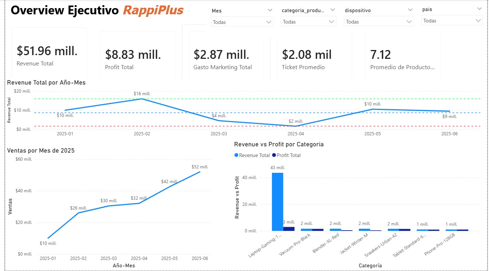
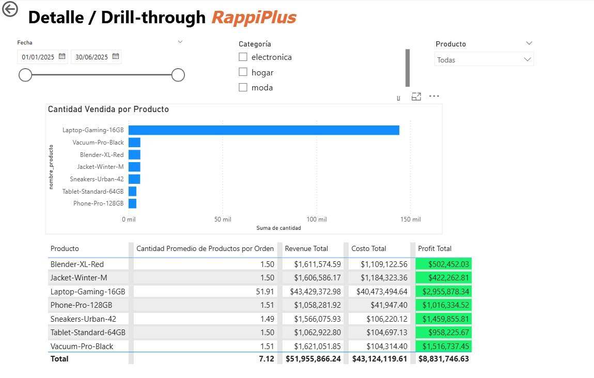

# RappiPlus — Data Analysis & Business Intelligence

## 📌 Project Overview

RappiPlus is an end-to-end data analytics project focused on evaluating
business profitability, user conversion, and checkout performance.

The project combines data cleaning and analysis in Python, SQL-based
funnel analysis, statistical A/B testing, and an interactive Power BI
dashboard.

## 🎯 Business Questions

- Is the business profitable after accounting for product costs and
  marketing expenses?
- Which products and categories contribute most to revenue and profit?
- At which stage of the conversion funnel are users being lost?
- Does a change in the checkout UI significantly affect purchase
  conversion?

## 🛠️ Tools & Technologies

- Python — Pandas, NumPy
- SQL — PostgreSQL, SQLAlchemy
- Statistical Analysis — A/B testing
- Power BI — DAX, data modeling and interactive dashboards
- Jupyter Notebook

## 🔄 Project Workflow

1. Data loading and quality assessment
2. Data cleaning and validation
3. Profitability analysis
4. SQL conversion funnel analysis
5. Checkout A/B testing
6. Power BI dashboard development
7. Business insights and recommendations

## 📊 Key Findings

### Profitability

- **Total revenue:** $51.96M
- **Total product costs:** $43.12M
- **Marketing investment:** $2.87M
- **Total profit:** $5.96M
- **Top-selling product:** Laptop-Gaming-16GB, with 144,198 units sold

The business generated a positive profit after accounting for product costs and marketing investment. Total profit represented approximately **11.5% of revenue**, indicating a positive overall operating result.

### Conversion Funnel

- **First visits:** 7,796 users
- **Purchases:** 6,240 users
- **Overall conversion:** 80.02%
- **Largest drop-off:** Between `begin_checkout` and `add_payment_info`
- **Conversion at the largest drop-off:** 86.71%
- **Users lost at this stage:** 958

The largest drop-off occurs during the payment information stage, suggesting that the checkout and payment process represents the main opportunity for improving conversion.

A small anomaly appears between `select_item` and `add_to_cart`, where the number of unique users increases slightly. This results from the event-level nature of the dataset, where some users may generate an `add_to_cart` event without a recorded `select_item` event.

### User Retention

Cohort analysis was performed for users registered between January and May 2025.

Retention remained relatively stable across cohorts, with approximately 41–42% of users active in Week 2 and around 40–43% in Week 3.

The results show consistent short-term retention patterns across the analyzed cohorts.

### A/B Testing

An A/B test was conducted to evaluate whether a change in the checkout UI affected purchase conversion.

- **Control vs. treatment:** Conversion rates were compared between the two variants.
- **Test statistic:** z = -0.813
- **p-value:** 0.416
- **Result:** The difference between the two variants was not statistically significant.

The results do not provide sufficient evidence to conclude that the checkout UI change had a measurable impact on purchase conversion.

## 📈 Power BI Dashboard

An interactive Power BI dashboard was developed to monitor business performance and explore revenue, profitability, product performance, and order-level details.

### Executive Overview

The executive dashboard includes:

- Revenue and profit KPIs
- Marketing investment
- Average ticket
- Average quantity per order
- Monthly revenue and profit trends
- Revenue and profit by product category

### Product & Order Details

The detailed analysis includes:

- Revenue, cost, and profit by product
- Quantity sold
- Order-level information
- Product performance
- Interactive filters
- Drill-through analysis

## 📈 Power BI Dashboard

An interactive Power BI dashboard was developed to monitor business performance and explore revenue, profitability, product performance, and order-level details.

### Executive Overview

The executive dashboard includes:

- Revenue and profit KPIs
- Marketing investment
- Average ticket
- Average quantity per order
- Monthly revenue and profit trends
- Revenue and profit by product category

### Product & Order Details

The detailed analysis includes:

- Revenue, cost, and profit by product
- Quantity sold
- Order-level information
- Product performance
- Interactive filters
- Drill-through analysis

## 💡 Business Recommendations

Based on the analysis, the following actions could help improve business performance:

1. **Optimize the checkout and payment process**
   
   The largest funnel drop-off occurs between `begin_checkout` and
   `add_payment_info`, with a conversion rate of 86.71%. This stage
   should be investigated to identify potential friction in the payment
   information process.

2. **Continue monitoring product profitability**
   
   The business generated $5.96M in profit with an overall profit margin
   of approximately 11.5%. Monitoring profitability at the product and
   category level can help identify opportunities to improve margins.

3. **Investigate user behavior between product selection and cart**
   
   The number of users performing `add_to_cart` slightly exceeds those
   performing `select_item`. This suggests that some users may be
   generating events without a corresponding recorded previous step,
   which should be investigated to improve event tracking and funnel
   accuracy.

4. **Continue monitoring cohort retention**
   
   Retention remained relatively stable across the analyzed cohorts,
   with approximately 41–42% retention in Week 2 and 40–43% in Week 3.
   Cohort monitoring should be maintained to detect future changes in
   user engagement.

5. **Use experimentation before implementing checkout changes**
   
   The A/B test did not provide statistically significant evidence that
   the tested UI change affected purchase conversion. Future checkout
   changes should continue to be evaluated through controlled
   experiments before being rolled out broadly.

---

## 🚀 How to Use

### Python Analysis

1. Clone or download this repository.
2. Open `RappiPlus_Analysis.ipynb` using Jupyter Notebook, JupyterLab, Google Colab, or VS Code.
3. Install the required Python libraries.
4. Configure the PostgreSQL connection using environment variables before running the SQL analysis sections.

> Database credentials are not included in this repository for security reasons.

### Power BI

Open `RappiPlus_Dashboard.pbix` with Power BI Desktop to explore the interactive dashboard.
